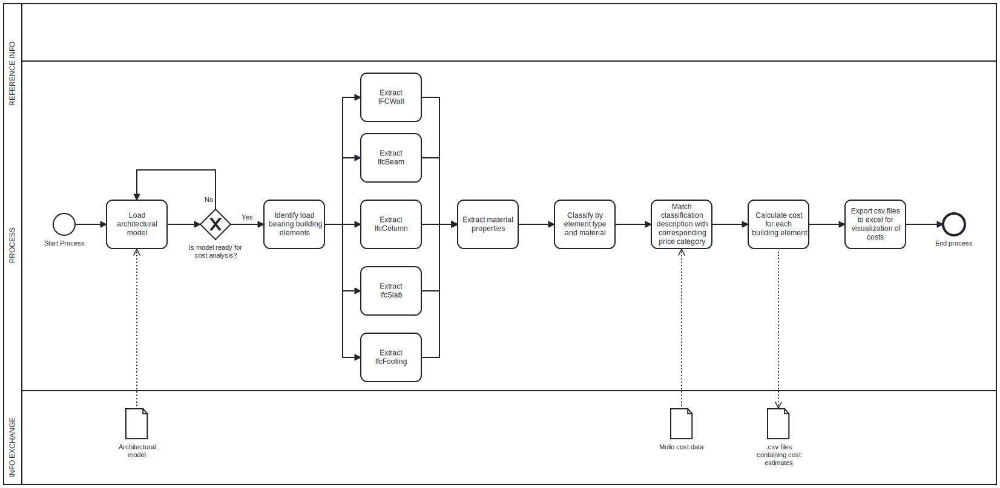

# A4 Usecase, Cost Estimation.

## Changes
* Creating CSVs
* More narrow scope, only focus on foundation, beams, columns, slabs and walls

After discussing our usecase and its applicability in the industry with the two representatives from Niras, we decided that to make our work tool more usefull, we had to create CSVs, where the name, type, quantity and price of each bulding element were displayed. This output will make categorizing the prices easier, and contractors will quickly be able to make calculations and decisions on which parts of the bulding are the largest cost drivers. Another difference for this final product and the earlier handed in versions is that the scope of the work tool is narrower, making it more specific, but also more detailed. This means extracting more infomation from the IFC model, to create more precise cost estimates.

---

## Goal
* To give a cost estimate of the main structural elements of a project at an early design stage.

Eventhough the overall goal of the work tool is still the same as before, because of the changes made, the work tool could be especially helpful in the financial analytics of the contractors building plans. The tool will assist in evaluating where the cost of the main structure has its largest potential of cost cut.  

---

## Description of The Process & Usecase
The usecase for the tool states that properties from the IFC will be extracted, matched with corresponding price data, and checked if is satisfactory (see diagram below). To be clear, the tool will not on its own check if costs are satisfactory, because doing so depends on the budget of the contracor among other things. The usecase describes with what intention the work tool was made. The work tool itself takes part in the extraction of the right information, and the calculations of costs. 



---

## How it works
 * Count spesific IFC by name (IfcWall)
 * Extraction of only loadbearing elements
 * Extracting element properties
 * Matching price data with spesific element type
 * Create CSV for each elements

### Beams:
For the beams in the ifc model the work tool differentiates in both which type of material (Steel or Concrete) and what thickness the beams are. Since the MOLIO price data has a limited number of beams with a spesific descriptions, we have chosen the MOLIO elements that fit the IFC elements the best. 
It is worth noting that for every property extracted in all bulding elements, ``` LoadBreaing = True ```

### Walls:
When bulding the code for the walls we encountered some problems due to the fact that all walls in the IFC were quite poorly categorised. The biggest problem was that part of the foundation was classified as IfcWallStandardCase, same ass all the other walls in the model. To make the work tool usable we worked around this problem by defining walls below ground (baseconstrain = T/FDN) in a certain price class and walls above as another (read 'note'). Another problem with the model was that none of 1. and 2. floor walls were defined as loadbearing even though they were designed to be loadbearing. That makes all the walls extracted from the model part of the external and internal foundation of the structure, eventhough the code is able to perform calculations for walls on all levels. The wall materials are catergorized into three different categories, which are then categorised into different thicknesses.

### Slabs:


The work tool essentially works in the five different parts described above. The first parts consists of is using IfcOpenshell attributes  .byType and RelDefinesByProperties to extract both the materials and the material quantities required by the MOLIO JSON file. Before the extraction the tool checks that all elements being extracted are defined as LoadBearing = True, so that as the use case states, we calculate the estimated cost for the main structural elements of the building. Next, the work tool will categorize which materials and quantitative properties define the specific element and linking it up to the price fitting that specific description. Lastly the code creates the CSV files, that you could use directly to visualizing costs, and create analysis. 

A brief example of how the output data could be visualized:


---

# note:
Since the IFC files we have looked at have defined its parameters differently and in different locations, we have made our code to specifically work for the ‘Duplex A’, to illustrate how the work tool should be utilized. This means that making sure materials and structural element properties are defined properly in IFCs would require a code that is simpler, quicker, and useable for any IFC file.

It should also be noted that the price file from MOLIO is an incomplete pricecatalog where all prices are multiplied with a arbritary numbers, and can therefore not be used for realistic calculations of price. Because of this we have chosen the pricing elements which resembles the building elements in the model. 

 


 
